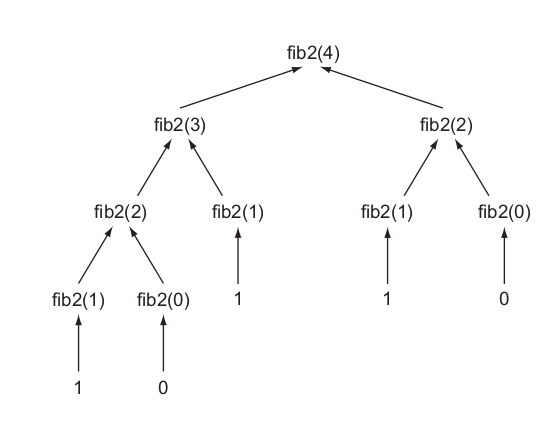
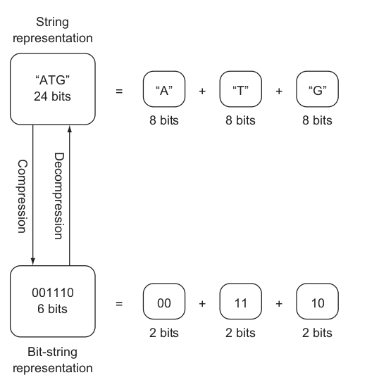
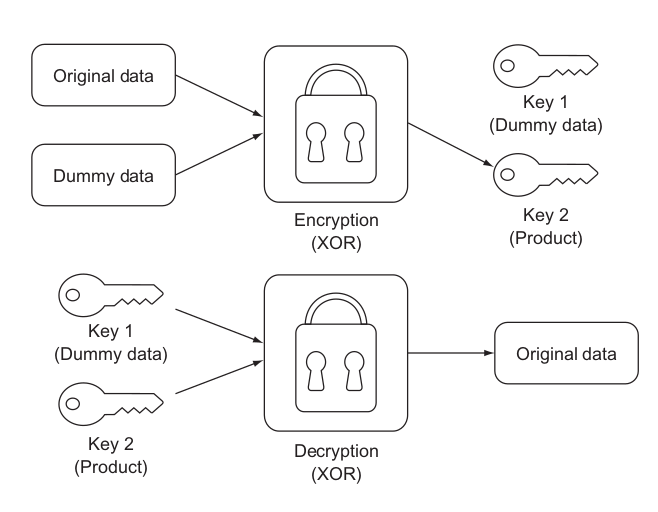

# Small Problems

Goal of this chapter is to get familiar with a couple of problem-solving techniques. Problems:

## 1. 1 The Fibonacci Sequence

A series that a number is produced by sum of the two previous number, except for the first two numbers:

$0, 1, 1, 2, 3, 5, 8, 13, 21$

$fib(n) = fib(n - 1) + fib(n - 2) \, for \, n=2, 3, \dots$

1.1.1 A first recursive attempt - without base cases.

1.1.2 utilizing base cases (base case; recursion case)

1.1.3 **memoization** to the rescue

1.1.4 **automatic** memoization

1.1.5 keep it simple, Fibonacci: Iterative solution is way faster the recursive one [[1](https://stackoverflow.com/questions/63656099/why-is-fibonacci-iterative-slower-than-the-recursive-version-with-memoization)].

1.1.6 Generating Fibonacci numbers with a **generator**

**OPTIONAL**: we want to find the number of function calls, [link](https://zhu45.org/posts/2017/Jan/22/num-of-function-calls-in-recursive-fibonacci-routine/).

## 1.2 Trivial compression

Compression is a trade-off between **time** and **space**. In high-level programming language sometimes you see such a waste of memory to make it more readable. Python does not have a bit-string off-the-shelf, let's do something similar to that to understand the idea of compression. A 00, C 01, G 10, T 11

## 1.3 Unbreakable encryption

This problem is about one-time pad:

A ^ B = C

C ^ A = B

C ^ B = A

original ^ random = product

product ^ random = orig

To be unbreakable, dummy data must:

1. be the same length as the original data.
2. Truly random
3. Completely secret

## 1.4 Calculating pi

The idea behind this problem is to model a mathematic formula into some code. **Leibniz** formula

n = $\frac{4}{1}-\frac{4}{3}+\frac{4}{5}-\frac{4}{7}+\frac{4}{9}$

## 1.5 The Towers of Hanoi

More of recursive functions; importance of the base case.

Interesting [link](http://www.cs.cmu.edu/~cburch/survey/recurse/hanoi.html), number of function calls, [link](http://www.cs.cmu.edu/~cburch/survey/recurse/hanoiclosed.html).

Typing Generic and TypeVar [blog post](https://medium.com/@steveYeah/using-generics-in-python-99010e5056eb)

Protocol Type, [Youtube](https://www.youtube.com/watch?v=kDDCKwP7QgQ).
