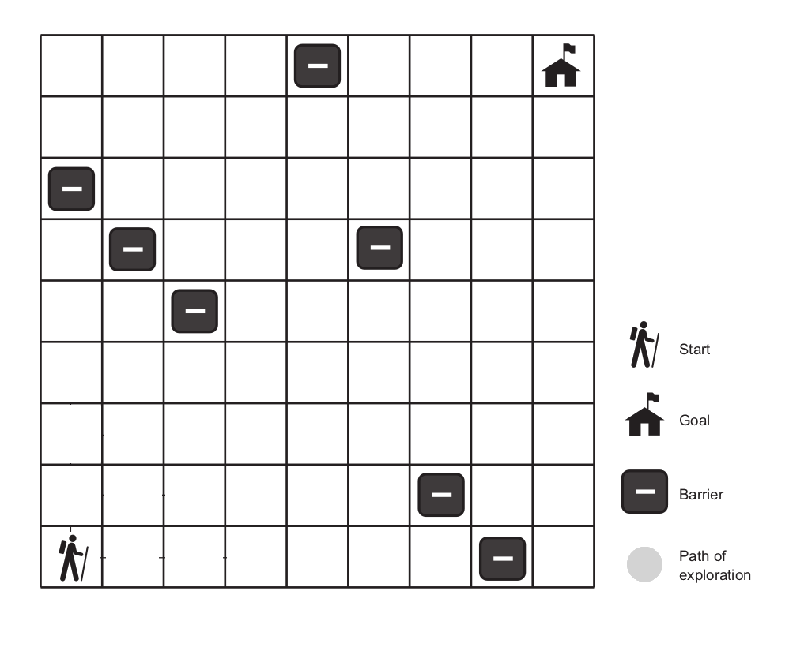
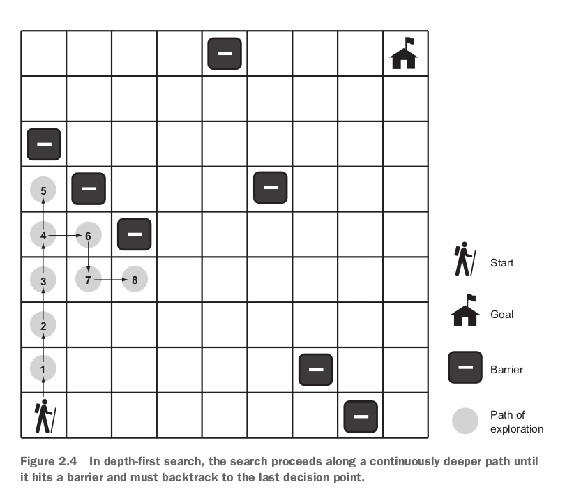
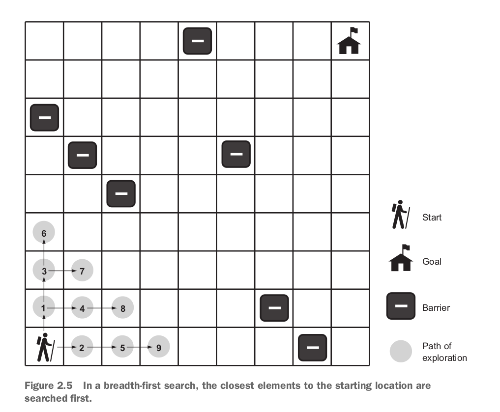
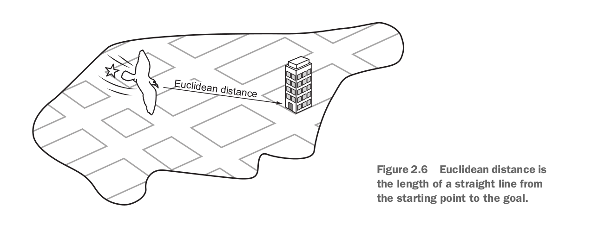
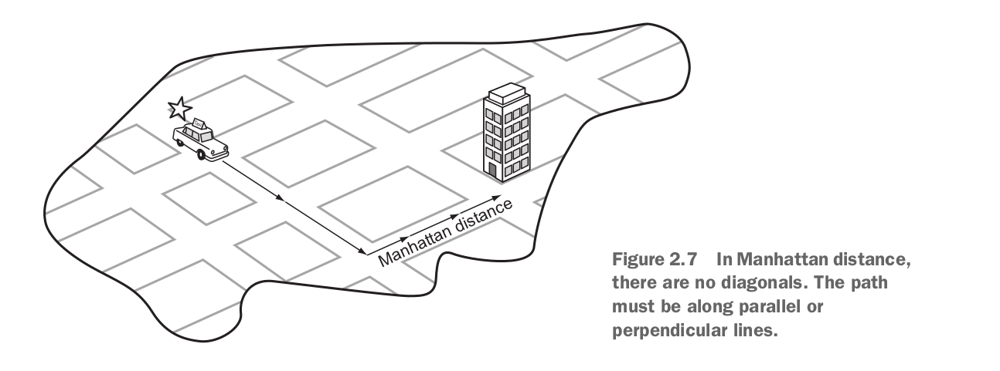
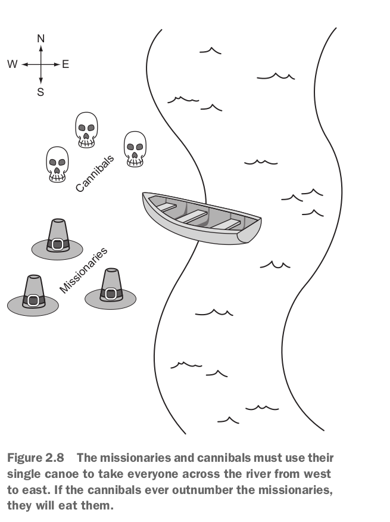

# Search Problems

As the book say, we can generally call most of computer science problems, search problems, even the state-of-the-art problems such as deep learning.

## 2.1 DNA Search

Genes are represented as a sequence of the characters: $A, C, G, T$. Do you remember compression problem?

* Each letter is called *nucleotide*
* Combination of three nucleotides forms a ***codon***

A common task in bio-informatics software is to **search for** a particular codon.

- [x] Type Aliasing, Codon, Gene
- [x] Nucleotide (`IntEnum`), linear_contains, binary_contains
- [x] generic_search

- [x] Show the performance advantage of binary search over linear search (experimentally)

External links:

* [Usefulness of Enum in Python](https://stackoverflow.com/questions/37601644/python-whats-the-enum-type-good-for)

* [Anther useful link to Enum](https://florian-dahlitz.de/articles/why-you-should-use-more-enums-in-python)

## 2.2 Maze solving

- [ ] Problem representation

- [ ] DFS (Stack, Node, dfs, node_to_path, mark, clean): As its name applies it goes as deeply as it can before backtracking. We need to take of **two data structures**, a stack of states that we are considering searching (frontier) and the set of states that we have already searched (explored).

- [ ] BFS: You may notice that the solution paths for DFS seem **unnatural** and <u>they are not usually the shortest paths</u>. While <u>BFS promises to always find the shortest path</u>, by checking one layer each time. Is some cases DFS might be faster than BFS or vice versa. Normally DFS is used to find whether <u>there is a solution</u>; while BFS finds the shortest path if such one exists.
  * BFS requires a queue which it is implemented using `deque` in Python (you cannot use python `list` for the queue it is expensive when you remove from the beginning).

- [ ] A*: Unlike BFS, A\* takes the cost of movement into consideration.

$f(n) = g(n) + h(n)$

$g(n)$ = examines the cost to get to a particular state.

$h(n)$ = gives an **estimate** of the cost to get **from the state in question** to the **goal state**.

if the estimation is **admissible**, then it can be proved that the final path found will be optimal.

* An admissible heuristic is one that **never overestimates** the cost to reach the goal

When choosing the next state to explore from the frontier, an A* search picks the one with the **lowest** $f(n)$. This is how it distinguishes itself from BFS and DFS.

* A\* uses a `PriorityQueue` for its frontier to find the state with the lowest cost. It is implemented using `heappush` and `heappop` which results in $\lg(n)$ for each push and pop operation.
* Euclidean distance measure is implemented as a closure to capture the goal state.

* Though at first euclidean distance makes sense, after second thought, you might Manhattan distance a better distance measure as the maze does not support **diagonal movement**.

* To convert a BFS into A\*, it needs to modification: firstly, changing the frontier from a simple queue to binary heap (priority queue) and secondly, change the explored set to dictionary to keep track of lowest cost of each node ($g(n)$).

- [ ] Add a counter for DFS, BFS, and A\* to see how many states each searches

### Comparison between search algorithms

* As both DFS and BFS do not care about the cost of movement, they are better off for small data sets or **state space searches**. 
* If A\* is used with an admissible heuristic, not only delivers an optimal paths, but also **far outperforms** BFS. The paths for both BFS and A\* might be the same or at least very similar, but you might notice A\* paths looks more like a diagonal; and it will search fewer states than BFS.
* Interesting Video on [Youtube](https://www.youtube.com/watch?v=DINCL5cd_w0&list=LL&index=11)

## 2.3 Missionaries and cannibals

- [ ] Change the MCState representation to be usable for the DFS function (Hint: `__eq__` and`__hash__`)
