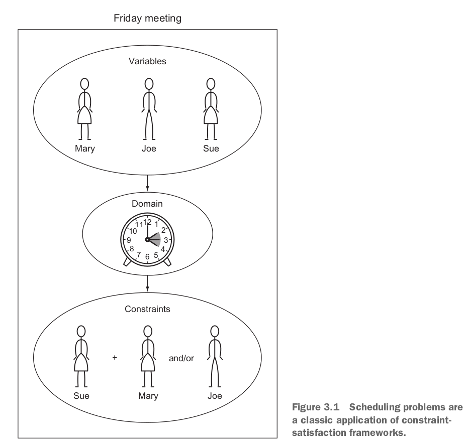
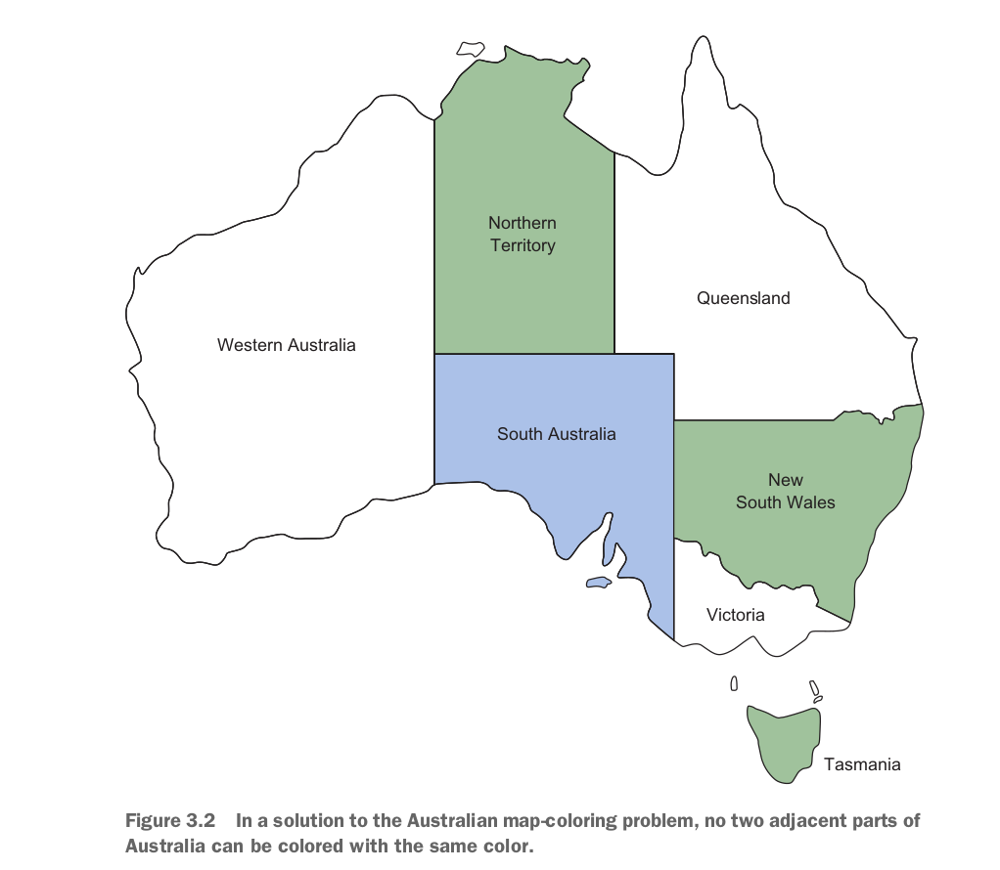
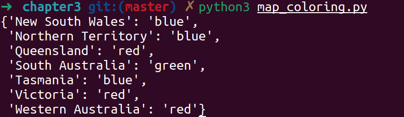
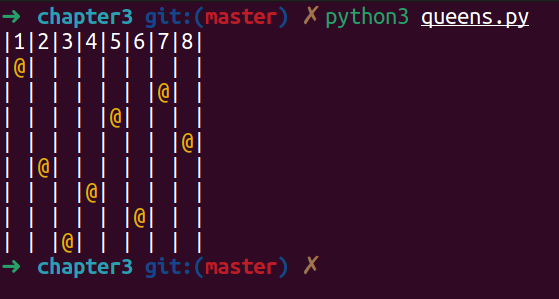
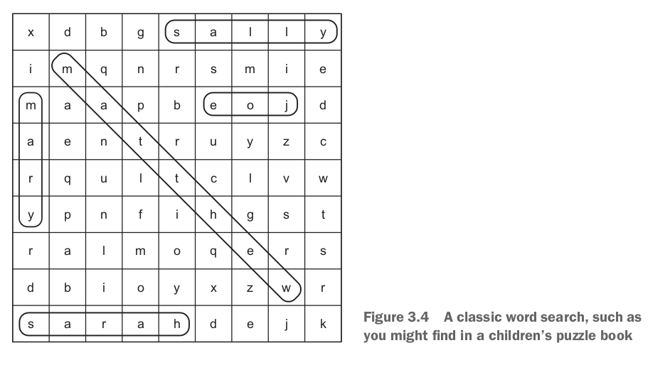
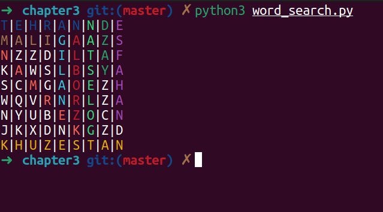
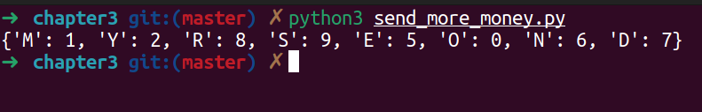
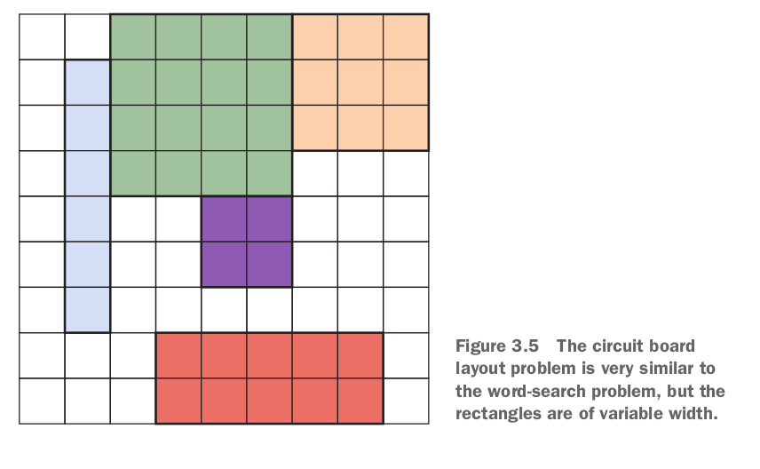
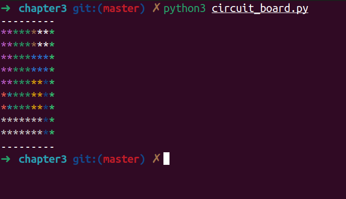
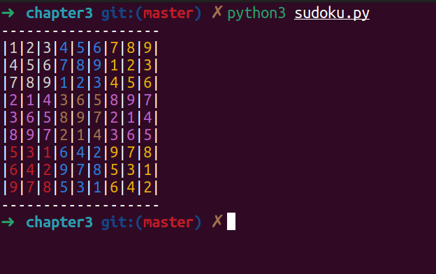

# Constraint Satisfaction Problem (CSP)

## Map Coloring

Given a *map* of *Australia*, it is using three *colors* such that no neighboring territories have same color.

## The Eight Queens

## Word Search

## SEND + MORE=MONEY

## Circuit Board Layout

## SUDOKU

